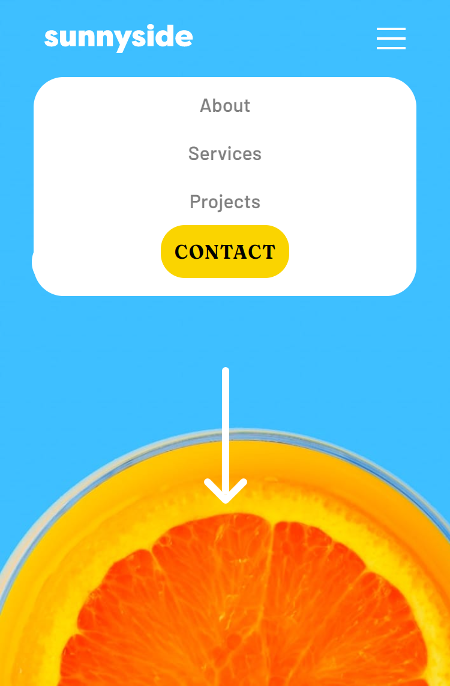

# Frontend Mentor - Sunnyside agency landing page solution

This is a solution to the [Sunnyside agency landing page challenge on Frontend Mentor](https://www.frontendmentor.io/challenges/sunnyside-agency-landing-page-7yVs3B6ef). Frontend Mentor challenges help you improve your coding skills by building realistic projects.

## Table of contents

- [Overview](#overview)
  - [The challenge](#the-challenge)
  - [Screenshot](#screenshot)
  - [Links](#links)
- [My process](#my-process)
  - [Built with](#built-with)
  - [What I learned](#what-i-learned)
  - [Continued development](#continued-development)
  - [Useful resources](#useful-resources)
- [Author](#author)
- [Acknowledgments](#acknowledgments)

## Overview

### The challenge

Users should be able to:

- View the optimal layout for the site depending on their device's screen size
- See hover states for all interactive elements on the page

### Screenshot




### Links

- Solution URL: [solution URL](https://www.frontendmentor.io/challenges/sunnyside-agency-landing-page-7yVs3B6ef/hub/sunnysideagencylandingpagemain-HJW9sGfE5)
- Live Site URL: [live site URL](https://gilded-macaron-cdce16.netlify.app/)

## My process
- It was quite hectic and fun at the same time while i was working on the project. I used the Mobile-first workflow which made my work very much easier.I actually thought i couldn't complete the challenge,but i'm happy i did.
### Built with

- Semantic HTML5 markup
- CSS custom properties
- Flexbox
- CSS Grid
- Mobile-first workflow
- Vanilla Javascript

### What I learned
I explored css Flexbox properties more,i also enjoyed working on the toggling classes.

```js
menu.addEventListener('click', () => {
    navBar.classList.toggle("show");
    for (let i = 0; i < navBarLinks.length; i++) {
        navBarLinks[i].classList.toggle("show"); 
    }
});
```

### Continued development

I want to continue working on projects that are related to this project because i really enjoyed it.

### Useful resources

- [Stack Overflow](https://stackoverflow.com/questions/21976227/classlist-add-does-not-work) - This is an amazing article which helped me finally understand classLists. I'd recommend it to anyone still learning this concept.

## Author

- Frontend Mentor - [@Michaelhybrid](https://www.frontendmentor.io/profile/Michaelhybrid)
- Twitter - [@micheal_olu99](https://twitter.com/micheal_olu99)

## Acknowledgments

To God be the glory.
